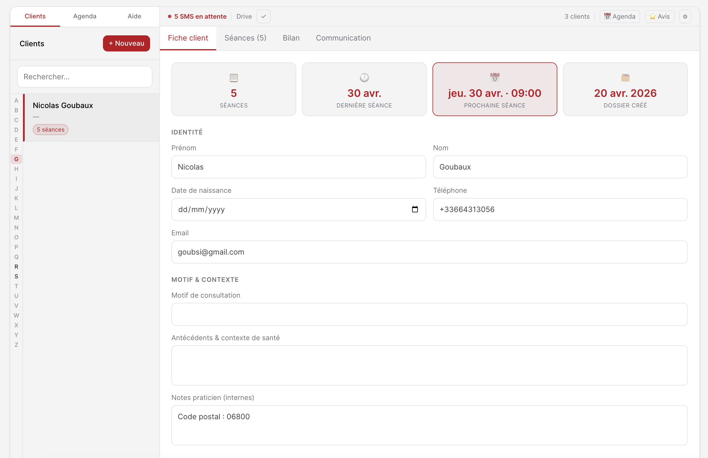
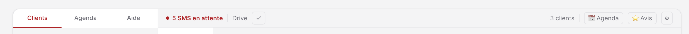
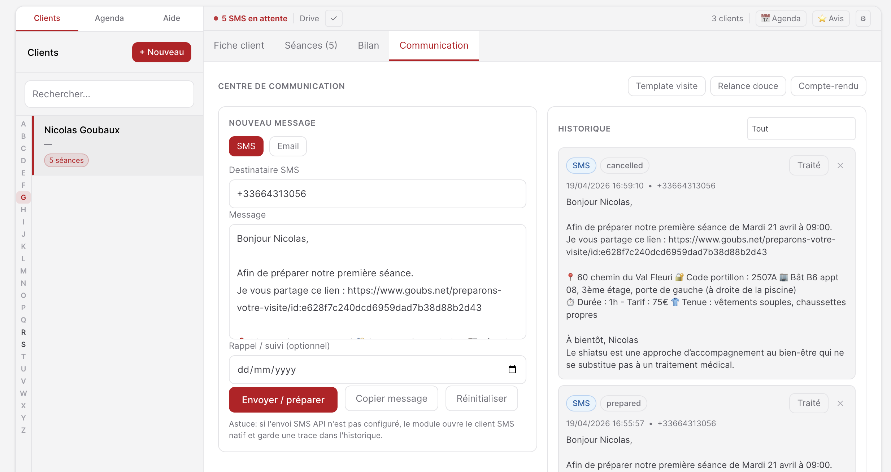
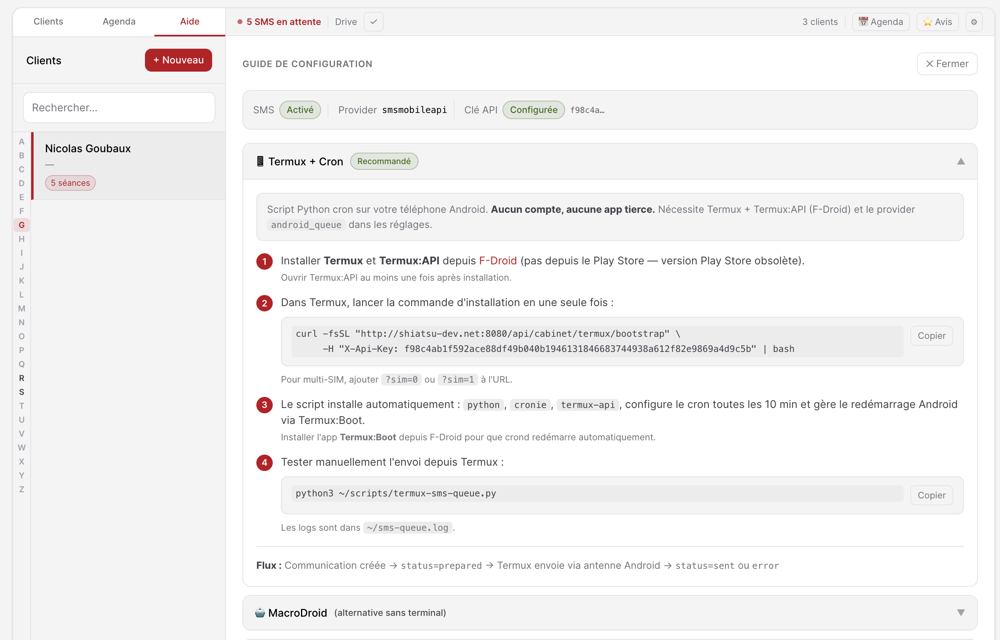

# Cabinet — Plugin Grav

Plugin de gestion de cabinet pour praticiens (shiatsu, sophrologie, etc.), construit sur [Grav CMS](https://getgrav.org). Il centralise les dossiers clients, les rendez-vous, les communications, les bilans PDF et les rappels SMS dans une interface Alpine.js mobile-first accessible depuis n'importe quel appareil.



---

## Sommaire

1. [Fonctionnalités](#fonctionnalités)
2. [Prérequis](#prérequis)
3. [Installation](#installation)
4. [Configuration](#configuration)
5. [Mise en place d'une page Cabinet](#mise-en-place-dune-page-cabinet)
6. [Fonctionnement de l'interface](#fonctionnement-de-linterface)
7. [Module Communication](#module-communication)
8. [Intégration Google (OAuth, Drive, Agenda)](#intégration-google)
9. [SMS — Multi-provider](#sms--multi-provider)
10. [Android natif — File d'attente SMS (MacroDroid / Termux)](#android-natif--file-dattente-sms-macrodroid--termux)
11. [Import de données](#import-de-données)
12. [Synchronisation Resalib (Google Apps Script)](#synchronisation-resalib)
13. [API REST](#api-rest)
14. [Scheduler Grav — Rappels automatiques](#scheduler-grav)
15. [Structure des fichiers](#structure-des-fichiers)
16. [Logs et débogage](#logs-et-débogage)

---

## Fonctionnalités

| Module | Description |
|--------|-------------|
| **Clients** | Dossiers clients stockés via Flex Objects (prénom, nom, DDN, téléphone, email, motif, antécédents, notes) |
| **Rendez-vous** | CRUD complet des séances (date, heure, durée, type, statut, observations, exercices) |
| **Agenda** | Vue calendrier mensuelle avec mini-calendrier + liste, synchronisation Google Calendar |
| **Communication** | Module dédié : historique des échanges SMS/email, envoi et suggestions de templates par client |
| **Bilan PDF** | Visualisation et upload des bilans Boox (NoteAir) depuis Google Drive |
| **Facturation** | Récapitulatif des séances réalisées par client |
| **SMS** | Envoi direct du SMS de préparation via fournisseur configurable (SMSMobileAPI, Simple SMS Gateway ou **android_queue**) + fallback local confirmé + rappels automatiques J-1 |
| **Import** | Import en masse de clients (CSV) et de rendez-vous (ICS) depuis l'interface, avec mode simulation |
| **Resalib Sync** | Script Google Apps Script pour synchroniser les RDV Resalib → Cabinet |
| **API REST** | Endpoints JSON sécurisés (session Grav ou clé API) pour intégration avec Make.com ou scripts tiers |
| **Menu Admin** | Entrée « Cabinet » dans la navigation Grav Admin (accès rapide `fa-briefcase`) |

---

## Prérequis

- **Grav** ≥ 1.7.0
- Plugin **Login** (authentification Grav)
- Plugin **Flex Objects** (stockage des données)
- PHP ≥ 7.4
- Accès HTTPS recommandé (requis pour Google OAuth, Service Worker PWA et Clipboard API)

---

## Installation

1. Copier le dossier `cabinet` dans `user/plugins/cabinet/`.

2. Vider le cache Grav :

   ```bash
   php bin/grav cache --purge
   # ou
   rm -rf cache/*
   ```

3. Activer le plugin dans l'administration Grav :
   **Plugins → Cabinet → Activer**

   Ou directement dans `user/plugins/cabinet/cabinet.yaml` :

   ```yaml
   enabled: true
   ```

---

## Configuration

Les paramètres système sont configurables dans l'administration Grav (**Plugins → Cabinet**).
Les paramètres métier praticien (Google, SMS provider, templates de communication, templates PDF bilan, coordonnées) sont configurés dans l'application Cabinet via **Paramètres** du praticien connecté.

```yaml
enabled: true

# Routes (configurables)
route_app_base: '/cabinet'      # slug de la page Cabinet
route_api_base: '/api/cabinet'  # base des endpoints API

# Clé secrète pour l'accès API externe (Make, scripts, etc.)
# Générer une clé longue et aléatoire avant déploiement
api_key: 'CHANGE_ME_BEFORE_DEPLOY'

# Origine CORS (* = toutes origines, ou URL précise)
allowed_origin: '*'

# SMS — Multi-provider
sms_enabled: false
sms_rappel_cron: '0 8 * * *'   # tous les jours à 8h00
```

### Paramètres praticien (profil Cabinet)

En complément de `cabinet.yaml`, chaque praticien dispose d'une section `cabinet:` dans son compte Grav `user/accounts/<username>.yaml`.

Exemple :

```yaml
cabinet:
  google_oauth_client_id: 'xxxx.apps.googleusercontent.com'
  google_calendar_id: 'xxxx@group.calendar.google.com'
  drive_bilan_path: 'onyx/NoteAir5c/Cahiers/clients'
  template_client_pdf: 'user/data/cabinet/templates/FicheTemplate_client.pdf'
  template_seance_pdf: 'user/data/cabinet/templates/FicheTemplate_rendezvous.pdf'
  sms_enabled: true
  sms_provider: 'android_queue'
  communication_google_review_url: 'https://g.page/r/XXXX/review'
  communication_template_prep_visite: 'Bonjour {{first_name}}, ...'
  communication_template_relance: 'Bonjour {{first_name}}, ...'
  communication_template_compte_rendu: 'Bonjour {{first_name}}, ...'
```

### Paramètres détaillés

| Paramètre | Description |
|-----------|-------------|
| `route_app_base` | Route de la page Cabinet (template `cabinet`). Doit correspondre au slug de la page créée dans Grav. |
| `route_api_base` | Base des endpoints API du plugin. Toutes les routes `/api/cabinet/...` de cette documentation utilisent cette valeur par défaut. |
| `api_key` | Clé secrète envoyée dans `X-Api-Key`. Changer avant mise en production. |
| `allowed_origin` | En-tête CORS `Access-Control-Allow-Origin`. |
| `sms_enabled` | Active l'envoi automatique des rappels J-1 via le scheduler Grav. |
| `sms_rappel_cron` | Expression cron pour l'heure d'envoi des rappels. |

Paramètres praticien (profil utilisateur connecté) :

| Paramètre | Description |
|-----------|-------------|
| `google_oauth_client_id` | Client ID OAuth 2.0 Google Cloud Console. |
| `google_calendar_id` | Identifiant du calendrier Google à synchroniser. |
| `drive_bilan_path` | Chemin Drive des fiches clients PDF. Séparateur `/`, sans slash en début/fin. |
| `template_client_pdf` | Chemin local du template PDF fiche client. Si vide, fallback global puis PDF intégré. |
| `template_seance_pdf` | Chemin local du template PDF fiche séance. Fallback : `template_client_pdf` praticien, puis global, puis PDF intégré. |
| `sms_enabled` | Active les rappels J-1 pour ce praticien. |
| `sms_provider` | Fournisseur SMS utilisé : `smsmobileapi`, `simple_sms_gateway` ou `android_queue`. |
| `communication_google_review_url` | URL fiche Google Business, utilisée dans les templates de compte-rendu. |
| `communication_template_prep_visite` | Template SMS de préparation visite (voir variables ci-dessous). |
| `communication_template_relance` | Template SMS de relance. |
| `communication_template_compte_rendu` | Template email de compte-rendu. |

---

## Mise en place d'une page Cabinet

1. Dans l'administration Grav, créer une nouvelle page.
2. Choisir le template **Cabinet**.
3. Activer l'accès réservé aux membres connectés : **Accès → site → login → Oui**.
4. Définir le slug de la page (ex: `/cabinet`).
5. Vérifier dans la configuration du plugin que `route_app_base` correspond au slug choisi.

L'interface est une SPA Alpine.js chargée dans cette page. L'entrée **Cabinet** apparaît automatiquement dans le menu de l'administration Grav.

### Exemple de personnalisation des routes

```yaml
route_app_base: '/mon-espace'
route_api_base: '/api/mon-espace'
```

Après modification des routes, vider le cache Grav :

```bash
bin/grav clearcache
```

---

## Fonctionnement de l'interface



### Sidebar — Clients / Agenda

La sidebar gauche dispose de deux vues :

- **Clients** : liste alphabétique avec compteur de séances, champ de recherche, bouton `+`.
- **Agenda** : mini-calendrier mensuel (pip sur les jours avec séances) + liste des séances du mois, navigation mois par mois.

Un clic sur une entrée de l'agenda ouvre directement la fiche du client concerné.

### Fiche client (onglet Fiche)

Stats en haut de fiche (4 cards) :

| Card | Contenu |
|------|---------|
| 📋 Séances | Nombre total |
| 🕐 Dernière séance | Date formatée (ex : `3 avr.`) |
| 📅 Prochaine séance | Prochaine séance **future** — date + heure (ex : `jeu. 24 avr. · 10:00`), mise en évidence en couleur |
| 🗂️ Dossier créé | Date de création du dossier |

Formulaire :
- Identité : prénom, nom, date de naissance, téléphone, email.
- Motif de consultation, antécédents, notes internes.
- **Lien Grav** : lie le client à un contact Grav (recherche par email ou nom).
- **SMS préparation visite** : envoi depuis l'onglet **Communication** avec message généré à partir du template admin.

### Séances (onglet Séances)

- Liste des séances dans l'ordre chronologique inverse.
- Bouton **Nouvelle séance** → modal de création.
- Chaque séance : date, heure, durée, type, statut, motif, observations, exercices, prochaine séance, bilan énergétique MTC.
- Option **Désactiver le rappel SMS J-1** par séance.
- Synchronisation Google Calendar : création/mise à jour de l'événement dans l'agenda configuré.

### Bilan (onglet Bilan)

- Affiche le PDF du bilan Boox stocké sur Google Drive.
- Si absent, bouton **Envoyer la fiche vierge sur Drive** (upload du `template_client_pdf` du praticien, fallback global, puis PDF intégré).
- Bouton **+ Fiche séance** : fusionne le `template_seance_pdf` du praticien à la fin du bilan existant (fallback sur `template_client_pdf` praticien puis global), puis re-uploade le fichier sur Drive. Utilise `pdf-lib` chargé à la demande — aucune dépendance serveur.

### Communication (onglet Communication)

Voir [section dédiée](#module-communication).

---

## Module Communication



L'onglet **Communication** de chaque fiche client offre un historique complet des échanges et des outils d'envoi.

### Fonctionnalités

- **Historique** des communications (SMS et email) par client, persisté côté serveur dans une collection Flex Objects dédiée (`communications`).
- **Filtres** : Tous / SMS / Email.
- **Rédaction** : zone de texte + objet (email), sélection du canal, date de suivi optionnelle.
- **Suggestions de templates** :

| Template | Canal | Description |
|----------|-------|-------------|
| Préparation visite | SMS | Message personnalisé avec lien de préparation |
| Relance | SMS | Message de relance après une séance |
| Compte-rendu | Email | Résumé de séance avec invitation avis Google |

- **Envoi SMS** via le fournisseur configuré (SMSMobileAPI ou Simple SMS Gateway).
- **Copie** du message dans le presse-papier.

### Nouveau flux SMS de préparation (2026)

- Envoi prioritaire via l'endpoint API `POST {route_api_base}/sms/send-preparation`.
- Message construit uniquement depuis `communication_template_prep_visite` (plus de message par défaut codé en dur).
- Routage serveur selon `sms_provider` (`smsmobileapi` ou `simple_sms_gateway`).
- Si l'envoi API échoue (ou est désactivé), l'interface propose explicitement d'ouvrir l'app SMS locale.
- En cas de refus utilisateur, l'action est enregistrée avec le statut `cancelled`.

### Templates admin configurables

Les templates sont configurables dans l'application Cabinet via **Paramètres → Communications** du praticien connecté.

#### Variables disponibles

| Variable | Description |
|----------|-------------|
| `{{first_name}}` | Prénom du client |
| `{{session_slot}}` | Créneau formaté en français — ex : ` de lundi 28 avril à 10:00` (vide si aucune séance future) |
| `{{preparation_link}}` | URL `preparons-votre-visite/id:xxx` personnalisée par client |
| `{{duration}}` | Durée formatée — ex : `1h15` |
| `{{session_date}}` | Date ISO de la dernière séance |
| `{{session_date_label}}` | Libellé de date — ex : ` du 28 avril 2025` |
| `{{google_review_url}}` | URL fiche Google Business (configurée dans les paramètres) |

#### Template par défaut — Préparation visite

```
Bonjour {{first_name}},

Afin de préparer notre première séance{{session_slot}}.
Je vous partage ce lien : {{preparation_link}}

📍 60 chemin du Val Fleuri 🔐 Code portillon : 2507A 🏢 Bât B6 appt 08, 3ème étage, porte de gauche (à droite de la piscine)
⏱️ Durée : {{duration}} - Tarif : 75€ 👕 Tenue : vêtements souples, chaussettes propres

À bientôt, Nicolas
Le shiatsu est une approche d'accompagnement au bien-être qui ne se substitue pas à un traitement médical.
```

### Architecture technique — objet Communication

Les communications sont stockées dans une collection Flex Objects **dédiée** (`user/data/flex-objects/communications.json`), indépendante de l'objet client. Ce choix permet :

- l'historique multi-appareil sans duplication dans le dossier client ;
- la suppression propre à la suppression d'un client ;
- une évolution future vers des communications multi-clients.

La classe `classes/Communication.php` gère l'intégralité de cette logique (lecture, écriture, suppression).

---

## Intégration Google

### Créer un Client OAuth 2.0

1. [Google Cloud Console](https://console.cloud.google.com/) → projet → activer **Drive API** + **Calendar API**.
2. **APIs & Services → Identifiants → Créer → ID client OAuth 2.0** (type : Application Web).
3. Ajouter l'URL du site dans **Origines JavaScript autorisées**.
4. Copier le **Client ID** dans la configuration (`google_oauth_client_id`).

### Flux d'authentification

Utilise **Google Identity Services (GIS)** en flux implicite côté client. Le token d'accès est stocké en `sessionStorage` avec vérification d'expiration et ré-authentification silencieuse automatique.

Scopes demandés :
- `drive.file` — lecture/écriture des fichiers créés par l'app
- `drive.readonly` — lecture des bilans Boox
- `documents` — création de docs Google Docs (anamnèse, bilan)
- `calendar.events` — lecture/écriture des événements Calendar

### Structure des bilans sur Google Drive

Le paramètre `drive_bilan_path` définit le dossier racine. Les bilans sont des fichiers PDF nommés **`Prénom Nom.pdf`** (prénom puis nom, séparés d'un espace), stockés directement dans ce dossier — pas de sous-dossiers par client :

```
Mon Drive/
└── onyx/NoteAir5c/Cahiers/clients/
    ├── Anne Dupont.pdf
    └── Jean Martin.pdf
```

### Tablette Boox Note Air 5C

1. Lier Google Drive dans la bibliothèque Boox : *Paramètres → Comptes → Stockage cloud → Google Drive*.
2. Depuis l'onglet **Bilan**, cliquer **Envoyer la fiche vierge sur Drive** (si aucun bilan).
3. Sur la tablette, ouvrir le PDF, annoter avec le stylet.
4. À la fermeture, la tablette synchronise automatiquement vers Drive.
5. Rafraîchir l'onglet Bilan dans Cabinet.

### Google Calendar

Renseigner `google_calendar_id` (visible dans les paramètres du calendrier → *Adresse de l'agenda*).

---

## SMS — Multi-provider

### Fournisseurs supportés

| Provider | Description | Coût |
|----------|-------------|------|
| `smsmobileapi` | API cloud SMSMobileAPI (requiert `sms_push_token`) | Payant |
| `simple_sms_gateway` | Endpoint HTTP d'un téléphone Android proxy (requiert `sms_simple_gateway_url`) | Gratuit |
| `android_queue` | File d'attente polled par MacroDroid ou Termux sur Android — **aucune app tierce, aucun compte** | Gratuit |

### Configuration du provider

Exemple Android natif (MacroDroid ou Termux) :

```yaml
sms_enabled: true
sms_provider: 'android_queue'
sms_push_token: 'votre-token-push'   # optionnel — injecté dans les scripts Android
```

Voir la [section Android natif](#android-natif--file-dattente-sms-macrodroid--termux) pour la configuration complète.

Exemple SMSMobileAPI :

```yaml
sms_enabled: true
sms_provider: 'smsmobileapi'
sms_push_token: 'votre-cle-api'
```

Exemple Simple SMS Gateway :

```yaml
sms_enabled: true
sms_provider: 'simple_sms_gateway'
sms_simple_gateway_url: 'https://votre-passerelle.example/send-sms'
sms_push_token: 'token-optionnel'   # même paramètre que pour android_queue
```

### Compte SMSMobileAPI (si provider = SMSMobileAPI)

1. Créer un compte sur [app.smsmobileapi.com](https://app.smsmobileapi.com).
2. Installer l'app Android sur un smartphone connecté en permanence.
3. Copier la clé API dans `sms_push_token`.

### Envoi manuel

Depuis l'onglet **Communication** :
- Le template de préparation est pré-rempli avec les données du client et de sa prochaine séance.
- L'envoi tente d'abord le provider configuré côté serveur, puis propose un fallback local (application SMS) avec confirmation utilisateur.
- Bouton *Copier* disponible pour le presse-papier.

Le numéro est normalisé automatiquement : `06XXXXXXXX` → `+336XXXXXXXX`.

### Rappels automatiques J-1

Quand `sms_enabled: true`, le scheduler Grav envoie un rappel SMS la veille de chaque rendez-vous non annulé.

> Pour personnaliser le message de rappel, modifier `buildRappelMessage()` dans `classes/Sms.php`.

### Désactiver le rappel pour une séance

Dans le formulaire de séance, cocher **Désactiver le rappel SMS J-1**.

### Logique anti-doublon

Le champ `sms_rappel_sent_date` empêche l'envoi de plus d'un rappel par jour et par rendez-vous.

---

## Android natif — File d'attente SMS (MacroDroid / Termux)



Avec le provider `android_queue`, Grav n'envoie pas les SMS directement. Il les écrit dans la file d'attente (`status=prepared`). Votre téléphone Android interroge cette file toutes les 10 minutes et envoie chaque SMS via l'antenne native.

**Aucun compte, aucune app tierce, aucun abonnement.**

### Activer le provider

```yaml
sms_enabled: true
sms_provider: 'android_queue'
sms_push_token: 'votre-token-push'   # optionnel — si vide, utilise api_key
```

> `sms_push_token` est le token partagé par les deux options ci-dessous. Si configuré, il est injecté dans les scripts Android et accepté comme `X-Api-Key` par l'API.

> Tous les exemples `/api/cabinet/...` ci-dessous utilisent la valeur par défaut de `route_api_base`.

### Option A — Termux + Cron (recommandé)

Script Python automatisé, installation en une commande. Nécessite :

- [Termux](https://f-droid.org/fr/packages/com.termux/) + **Termux:API** (depuis F-Droid)
- **Termux:Boot** (optionnel — relance automatique après redémarrage)
- Votre site Grav accessible en HTTPS depuis le téléphone

Depuis Termux, exécuter :

```bash
curl -fsSL "https://VOTRE_SITE{route_api_base}/termux/bootstrap" \
     -H "X-Api-Key: VOTRE_TOKEN" | bash
```

Pour un téléphone multi-SIM (utiliser la SIM slot 0) :

```bash
curl -fsSL "https://VOTRE_SITE{route_api_base}/termux/bootstrap?sim=0" \
     -H "X-Api-Key: VOTRE_TOKEN" | bash
```

> `VOTRE_TOKEN` = valeur de `sms_push_token` (ou `api_key` si `sms_push_token` est vide).

Le script bootstrap est **généré dynamiquement par Grav** avec l'URL du site et le token déjà injectés — aucune saisie interactive.

#### Ce que fait le bootstrap

1. Met à jour les paquets Termux (`pkg update`)
2. Installe les dépendances : `curl`, `python`, `cronie`, `termux-api`
3. Télécharge le script Python SMS depuis `GET {route_api_base}/termux/sms-queue` (pré-configuré par Grav)
4. Enregistre la tâche cron : `*/10 * * * * python3 ~/scripts/termux-sms-queue.py`
5. Configure le démarrage automatique de `crond` via Termux:Boot (si disponible)
6. Effectue un test de connexion à l'API

#### Fonctionnement du script Python

À chaque exécution (`termux-sms-queue.py`) :

```
GET {route_api_base}/sms/queue          → récupère les SMS status=prepared
  pour chaque SMS :
    termux-sms-send -n {to} {message}
    → succès : POST {route_api_base}/sms/queue/{id}/ack  {"status":"sent"}
    → échec  : POST {route_api_base}/sms/queue/{id}/ack  {"status":"error","error":"raison"}
```

Le script utilise exclusivement la bibliothèque standard Python (`urllib`, `json`, `subprocess`, `logging`) — aucun `pip install` nécessaire.

#### Logs

Les logs sont écrits dans `~/sms-queue.log` avec rotation automatique à 500 KB :

```
[2025-06-15 08:00:01] --- Démarrage ---
[2025-06-15 08:00:01] 1 SMS en attente
[2025-06-15 08:00:01] Envoi SMS id=abc123 vers +33600000000
[2025-06-15 08:00:02] SMS id=abc123 envoyé
[2025-06-15 08:00:02] ACK id=abc123 → statut 'sent'
[2025-06-15 08:00:02] Terminé — 1 envoyé(s), 0 échec(s)
```

#### Endpoints Grav utilisés

| Méthode | Route | Description |
|---------|-------|-------------|
| `GET` | `{route_api_base}/termux/bootstrap` | Script bootstrap pré-configuré (bash) — param optionnel `?sim=N` |
| `GET` | `{route_api_base}/termux/sms-queue` | Script SMS pré-configuré (Python) — param optionnel `?sim=N` |

Ces deux endpoints requièrent l'en-tête `X-Api-Key`.

---

### Option B — MacroDroid (sans ligne de commande)

Macro visuelle sur Android, aucun terminal nécessaire. Nécessite :

- [MacroDroid](https://play.google.com/store/apps/details?id=com.arlosoft.macrodroid) installé (version gratuite suffisante)
- Votre site Grav accessible en HTTPS depuis le téléphone

#### Créer le macro MacroDroid — pas à pas

Dans MacroDroid : appuyer sur **+** (bas de l'écran) → **Créer un macro** → donner un nom (ex : *Cabinet SMS*).

---

##### Déclencheur

1. Appuyer sur **DÉCLENCHEURS → +**
2. Choisir **Minuterie → Minuterie périodique**
3. Intervalle : **10 minutes** → OK

---

##### Action 1 — Récupérer la file d'attente SMS

1. **ACTIONS → +**
2. **Connectivité → Requête HTTP**
3. Remplir :
  - **URL** : `https://VOTRE_SITE{route_api_base}/sms/queue`
  - **Méthode** : `GET`
4. Appuyer sur l'onglet **En-têtes** → **+** → ajouter :
   - Clé : `X-Api-Key` / Valeur : `VOTRE_TOKEN`
   - Clé : `Accept` / Valeur : `application/json`
5. Onglet **Réponse** → cocher **Enregistrer la réponse dans une variable** → nom : `queue_response`
6. OK

---

##### Action 2 — Boucle sur chaque SMS en attente

1. **ACTIONS → +**
2. **Boucle → Pour chaque**
3. Dans **Source** choisir **Tableau JSON**
4. Variable JSON : `{queue_response}` (sélectionner depuis la liste)
5. Chemin JSONPath : `$.items`
6. Variable de boucle : `item`
7. OK

---

##### Action 3 — (dans la boucle) Extraire les champs

1. **ACTIONS → +**
2. **Variables → Définir une variable**
3. Créer la variable `sms_id`
   - Type de valeur : **Expression JSONPath**
   - JSON : `{item}`
   - Chemin : `$.id`
4. Répéter pour `sms_to` (chemin `$.to`) et `sms_message` (chemin `$.message`)

---

##### Action 4 — (dans la boucle) Envoyer le SMS

1. **ACTIONS → +**
2. **Messages → Envoyer un SMS**
3. **Numéro** : `{sms_to}`
4. **Message** : `{sms_message}`
5. OK

---

##### Action 5 — (dans la boucle) Confirmer l'envoi (ack)

1. **ACTIONS → +**
2. **Connectivité → Requête HTTP**
3. Remplir :
  - **URL** : `https://VOTRE_SITE{route_api_base}/sms/queue/{sms_id}/ack`
  - **Méthode** : `POST`
4. Onglet **En-têtes** → **+** :
   - `X-Api-Key` : `VOTRE_TOKEN`
   - `Content-Type` : `application/json`
5. Onglet **Corps** → `{"status":"sent"}`
6. OK

---

##### Action 6 — Fin de boucle

1. **ACTIONS → +**
2. **Boucle → Fin de boucle**

---

##### Action 7 — Notification (optionnel)

1. **ACTIONS → +**
2. **Notifications → Créer une notification**
3. **Titre** : `SMS Cabinet`
4. **Texte** : `SMS envoyés ✓`
5. OK

---

#### Remplacer les variables

| Placeholder | Valeur |
|-------------|--------|
| `VOTRE_TOKEN` | Valeur de `sms_push_token` (ou `api_key` si `sms_push_token` est vide) — envoyée dans l'en-tête `X-Api-Key` |

---

### Flux complet (Termux ou MacroDroid)

```
Grav (provider=android_queue)
  → écrit status=prepared dans communications Flex

Termux cron / MacroDroid (toutes les 10 min)
  → GET {route_api_base}/sms/queue          (récupère les SMS préparés)
  → Envoie chaque SMS via antenne Android
  → POST {route_api_base}/sms/queue/{id}/ack (marque status=sent ou error)
  → Grav met à jour status + sent_at ou error_at
```

### Endpoint ACK — statuts supportés

| Body envoyé | Effet côté serveur |
|---|---|
| `{"status": "sent"}` | `status=sent`, `sent_at=<horodatage>` |
| `{"status": "error", "error": "raison"}` | `status=error`, `error_at=<horodatage>`, `error_message=<raison>` |

### Retrouver les SMS envoyés

Dans l'onglet **Communication** de chaque client, les SMS passent automatiquement de `prepared` → `sent` après l'ack. Le champ `sent_at` contient l'horodatage exact.

---

## Import de données

L'interface propose un import en masse accessible via le bouton **⇅ Import** dans la sidebar (vue Clients).

### Clients — CSV

Importe un fichier CSV depuis un export Resalib ou tout autre source.

**Format attendu** (première ligne = en-têtes) :

```
email,prenom,nom,telephone,code_postal
alice@example.com,Alice,DUPONT,0612345678,75010
```

| Colonne | Requis | Description |
| ------- | ------ | ----------- |
| `email` | Oui | Adresse email |
| `prenom` | Oui | Prénom |
| `nom` | Oui | Nom de famille |
| `telephone` | Non | Normalisé automatiquement (`06…` → `+336…`) |
| `code_postal` | Non | Stocké dans le champ Notes |

**Logique de déduplication** : recherche d'abord par téléphone, puis par email. Si un client correspondant est trouvé, il est mis à jour ; sinon un nouveau dossier est créé avec un UUID généré.

### Rendez-vous — ICS

Importe un fichier `.ics` (export Google Calendar, Resalib, etc.).

**Format SUMMARY attendu** :

```
Prénom NOM | Resalib.fr
```

Le dernier token tout en majuscules est interprété comme le nom de famille. La correspondance client se fait par prénom + nom (insensible aux accents).

| Champ ICS | Champ Cabinet |
| --------- | ------------- |
| `DTSTART` | Date + heure (converti Europe/Paris) |
| `DTEND` | Durée calculée en minutes |
| `STATUS` | `CONFIRMED` → `confirmed`, `TENTATIVE` → `planned`, `CANCELLED` → `cancelled` |
| `DESCRIPTION` | Type de séance (`chaise` → `shiatsu_chair`, `sophrologie`, sinon `shiatsu_futon`) + motif |
| `UID` | Stocké dans `observations` pour la traçabilité |

**Logique de déduplication** : un rendez-vous existant sur le même triplet `(client, date, heure)` est mis à jour ; sinon il est créé.

### Mode simulation

Le toggle **Simulation** (activé par défaut) prévisualise les opérations sans modifier aucune donnée. Le résultat affiche le log complet (CREATE / UPDATE / SKIP / ERROR) et les compteurs. Désactiver le toggle pour effectuer l'import réel.

### Scripts CLI

Les mêmes imports sont aussi disponibles en ligne de commande (hors interface) :

```bash
# Import clients
BASE_URL=https://monsite.com API_KEY=ma-cle python3 import_clients.py clients.csv

# Import rendez-vous (mode simulation)
DRY_RUN=1 BASE_URL=https://monsite.com API_KEY=ma-cle python3 import_rendezvous.py agenda.ics
```

---

## Synchronisation Resalib

Le fichier `assets/resalib-sync.gs` est un **Google Apps Script** qui synchronise en temps réel les rendez-vous Resalib (via Google Calendar) vers Cabinet, en utilisant les push notifications de l'API Google Calendar.

### Architecture

```
Resalib
  → écrit les RDV dans un Google Calendar partagé

Google Calendar (push notifications)
  → POST à l'URL du script déployé (WEBHOOK_URL) à chaque modification

Google Apps Script (resalib-sync.gs)
  → sync incrémentale (token de sync)
  → résolution du client Cabinet par email ou nom
  → POST/PUT/DELETE {route_api_base}/rendezvous
```

Un déclencheur toutes les 15 minutes assure la sync même si un push est manqué. Le watch channel est renouvelé automatiquement chaque nuit avant expiration (7 jours max).

### Installation

1. [script.google.com](https://script.google.com) → **Nouveau projet** → coller `resalib-sync.gs`.
2. **Services → +** → ajouter **Google Calendar API**.
3. Remplir la section `CONFIG` du script :

```javascript
const CONFIG = {
  CALENDAR_ID:      'xxxx@group.calendar.google.com', // calendrier Resalib
  WEBHOOK_URL:      'https://script.google.com/macros/s/XXXX/exec', // URL du script déployé
  CABINET_BASE_URL: 'https://monsite.com',
  CABINET_API_KEY:  'votre-cle-api',                  // cabinet.yaml → api_key
};
```

4. **Déployer → Nouveau déploiement** → Type : Application web → Exécuter en tant que : Moi → Accès : Tout le monde → copier l'URL dans `WEBHOOK_URL`.
5. Exécuter **`setupAll()`** une seule fois depuis la console Apps Script.

### Paramètres CONFIG

| Paramètre | Description |
| --------- | ----------- |
| `CALENDAR_ID` | ID du calendrier Google connecté à Resalib (visible dans ses paramètres) |
| `WEBHOOK_URL` | URL de déploiement du script (disponible après le déploiement) |
| `CABINET_BASE_URL` | URL du site Grav sans slash final |
| `CABINET_API_KEY` | Valeur de `api_key` dans `cabinet.yaml` |
| `SYNC_DAYS_PAST` | Fenêtre passée de la sync initiale (défaut : 7 jours) |
| `SYNC_DAYS_FUTURE` | Fenêtre future de la sync initiale (défaut : 90 jours) |
| `DEFAULT_APPOINTMENT_TYPE` | Type de séance si non détecté (défaut : `shiatsu_futon`) |
| `DEFAULT_DURATION_MINUTES` | Durée par défaut si `DTEND` absent (défaut : 60) |
| `TYPE_PATTERNS` | Regex → `appointment_type` (testés sur titre + description) |
| `STATUS_PATTERNS` | Regex → statut Cabinet (testés sur le titre de l'événement) |

### Format des événements Resalib

**SUMMARY** : `Prénom NOM | Resalib.fr`
Le dernier token tout en majuscules est le nom de famille (même règle que `import_rendezvous.py`).

**DESCRIPTION** (format multi-lignes) :

```
À domicile              ← optionnel, ignoré
Prénom NOM              ← nom du client, ignoré (déjà dans SUMMARY)
Consultation (Suivi) - Cabinet Cagnes-sur-Mer  ← motif
Details : https://resalib.fr/…                 ← ignoré
Annulation : https://resalib.fr/…              ← ignoré
Message utilisateur : texte libre              ← observations
```

### Résolution du client Cabinet

Pour chaque événement entrant, le script résout l'UUID Cabinet dans cet ordre :

1. **Email attendee** — si l'événement a un participant, son email est cherché dans la map locale.
2. **Nom extrait du SUMMARY** — clé `"prénom nom"` (minuscules) dans la map locale.
3. **Appel API** `GET /api/contacts/search?first_name=…&last_name=…` — les accents sont supprimés pour la comparaison. Si trouvé, le mapping est mis en cache.
4. **Introuvable** → événement ignoré avec un message dans les logs.

Si un client n'est pas trouvé automatiquement, utiliser `addClientMapping()` (voir ci-dessous).

### Déclencheurs installés par `setupAll()`

| Déclencheur | Fréquence | Rôle |
| ----------- | --------- | ---- |
| `doPost` | Push Google Calendar | Sync incrémentale à chaque modification |
| `_incrementalOrFull` | Toutes les 15 min | Filet de sécurité si push manqué |
| `renewWatchIfNeeded` | Quotidien à 2h | Renouvelle le watch channel avant expiration |

### Fonctions console

| Fonction | Description |
| -------- | ----------- |
| `setupAll()` | Installation initiale : déclencheurs + watch + sync complète |
| `refreshCalendar()` | Sync complète forcée (efface le token et repart de zéro) |
| `resetAll()` | Remet tout à zéro (déclencheurs, watch, maps, token) |
| `inspectEventMap()` | Affiche la map `eventId → {flex_id, client_id}` |
| `inspectClientMap()` | Affiche la map `"prénom nom" → uuid Cabinet` |
| `addClientMapping('Prénom NOM', 'uuid')` | Ajoute manuellement un mapping client |
| `forceSyncEvent('eventId')` | Force la sync d'un événement précis par son ID Google |

**Exemple — mapping manuel :**

```javascript
// Depuis la console Apps Script (Ctrl+Entrée)
addClientMapping('Maryse DIGAT | Resalib.fr', 'a1b2c3d4e5f6…')
// équivalent : addClientMapping('Maryse DIGAT', 'a1b2c3d4e5f6…')
```

---

## API REST

Authentification : **session Grav** ou en-tête `X-Api-Key`.

Les routes listées ci-dessous utilisent les valeurs par défaut :

- `route_api_base: /api/cabinet`
- `route_app_base: /cabinet`

### Routes

| Méthode | Route | Description |
|---------|-------|-------------|
| `GET` | `{route_api_base}/data` | Données complètes (clients, séances, communications, config) |
| `GET` | `{route_api_base}/facturation` | Récapitulatif de facturation |
| `POST` | `{route_api_base}/clients` | Créer un client |
| `PUT` | `{route_api_base}/clients/{id}` | Modifier un client |
| `DELETE` | `{route_api_base}/clients/{id}` | Supprimer un client (+ communications associées) |
| `GET` | `{route_api_base}/rendezvous` | Lister tous les rendez-vous |
| `POST` | `{route_api_base}/rendezvous` | Créer un rendez-vous |
| `PUT` | `{route_api_base}/rendezvous/{flex_id}` | Modifier un rendez-vous |
| `DELETE` | `{route_api_base}/rendezvous/{flex_id}` | Supprimer un rendez-vous |
| `GET` | `{route_api_base}/communications/{client_id}` | Lister les communications d'un client |
| `PUT` | `{route_api_base}/communications/{client_id}` | Mettre à jour les communications d'un client |
| `POST` | `{route_api_base}/sms/send-preparation` | Envoyer le SMS de préparation via le provider SMS configuré (template admin + `client_id`) |
| `POST` | `{route_api_base}/sms/preparation` | Préparer/valider un brouillon de SMS de préparation (template admin) |
| `POST` | `{route_api_base}/sms/rappels` | Déclencher manuellement les rappels J-1 |
| `GET` | `{route_api_base}/sms/queue` | Lister les SMS en attente (`status=prepared`, `channel=sms`) — utilisé par MacroDroid et Termux |
| `POST` | `{route_api_base}/sms/queue/{id}/ack` | Mettre à jour le statut d'un SMS : body `{"status":"sent"}` ou `{"status":"error","error":"raison"}` |
| `GET` | `{route_api_base}/termux/bootstrap` | Script bash bootstrap pré-configuré (URL + clé API injectées par Grav) — param `?sim=N` |
| `GET` | `{route_api_base}/termux/sms-queue` | Script Python SMS pré-configuré (URL + clé API injectées par Grav) — param `?sim=N` |
| `POST` | `{route_api_base}/import/clients` | Importer des clients depuis un CSV (multipart `file` + `dry_run`) |
| `POST` | `{route_api_base}/import/rendezvous` | Importer des rendez-vous depuis un ICS (multipart `file` + `dry_run`) |
| `GET` | `/api/contacts/search` | Rechercher un client par nom/email |
| `GET` | `{route_app_base}/client-template.pdf` | Template PDF fiche client du praticien connecté (`template_client_pdf`), fallback global puis PDF intégré |
| `GET` | `{route_app_base}/seance-template.pdf` | Template PDF fiche séance du praticien connecté (`template_seance_pdf`), fallback `template_client_pdf` praticien puis global puis PDF intégré |
| `GET` | `{route_app_base}/bilan-template.pdf` | Alias rétrocompatible → `client-template.pdf` |

---

## Scheduler Grav

```bash
# Ajouter au cron serveur
* * * * * cd /chemin/vers/grav && php bin/grav scheduler 1>> /dev/null 2>&1
```

Vérifier dans **Outils → Scheduler**. Le job `cabinet-sms-rappels` n'est enregistré que si `sms_enabled: true`.

---

## Structure des fichiers

```
user/plugins/cabinet/
├── cabinet.php                       # Classe principale du plugin (DI, hooks, admin menu)
├── cabinet.yaml                      # Configuration par défaut
├── blueprints.yaml                   # Formulaire d'administration Grav
│
├── assets/
│   ├── cabinet.js                    # Logique legacy (Drive, Google Docs, utilitaires)
│   ├── cabinet.css                   # Styles (variables CSS, responsive, stat-cards…)
│   ├── main.js                       # Point d'entrée Alpine.js
│   ├── manifest.json                 # PWA manifest
│   ├── sw.js                         # Service Worker (PWA)
│   ├── cab-drive.js                  # Google Drive + Calendar (Alpine component)
│   ├── Fiche Client - Shiatsu.pdf    # Template PDF intégré (fallback si aucun template uploadé)
│   ├── resalib-sync.gs               # Google Apps Script (Resalib → Cabinet)
│   ├── components/
│   │   ├── sidebar.js                # Alpine component — sidebar clients/agenda
│   │   ├── modal.js                  # Alpine component — modale générique
│   │   ├── drive-bar.js              # Alpine component — barre Drive
│   │   ├── accordion.js              # Alpine component — accordéon séances
│   │   └── toast.js                  # Alpine component — notifications toast
│   ├── store/
│   │   └── index.js                  # Alpine store global (clients, sessions, communications…)
│   └── utils/
│       ├── api.js                    # Wrapper fetch/API
│       ├── constants.js              # Constantes (méridiens, états MTC…)
│       ├── helpers.js                # uid(), esc(), capitalize(), compactUuid()…
│       ├── sms.js                    # Utilitaires SMS (buildPreparationSms, getPreferredSession…)
│       └── toast.js                  # showToast()
│
├── blueprints/
│   ├── cabinet.yaml                  # Blueprint de la page Cabinet
│   └── flex-objects/
│       ├── clients.yaml              # Schéma Flex Objects — clients
│       ├── rendez_vous.yaml          # Schéma Flex Objects — rendez-vous
│       └── communications.yaml       # Schéma Flex Objects — communications (objet dédié)
│
├── classes/
│   ├── Core.php                      # Auth, CORS, helpers JSON
│   ├── Api.php                       # Routeur des endpoints REST
│   ├── Clients.php                   # Recherche de contacts Grav
│   ├── Seances.php                   # CRUD clients & rendez-vous, payload de données
│   ├── Communication.php             # Gestion des communications (lecture, écriture, suppression)
│   ├── Facturation.php               # Calcul du récapitulatif de facturation
│   ├── Import.php                    # Import en masse clients (CSV) et rendez-vous (ICS)
│   ├── Sms.php                       # Envoi SMS (SMSMobileAPI) + rappels J-1
│   └── Flex/
│       ├── ClientObject.php          # Classe Flex personnalisée — clients
│       └── RendezVousObject.php      # Classe Flex personnalisée — rendez-vous
│
├── scripts/
│   └── termux-bootstrap.sh           # Script bootstrap de référence (version hors-ligne avec placeholders)
│
└── templates/
    ├── cabinet.html.twig             # Template principal (assets, layout)
    ├── termux-bootstrap.sh.twig      # Bootstrap Termux pré-configuré (servi par {route_api_base}/termux/bootstrap)
    ├── termux-sms-queue.py.twig      # Script Python SMS pré-configuré (servi par {route_api_base}/termux/sms-queue)
    └── partials/cabinet/
        ├── main.html.twig            # Conteneur Alpine main + onglets
        ├── sidebar.html.twig         # Sidebar clients/agenda
        ├── modals.html.twig          # Modales (nouvelle séance, paramètres, vérif…)
        ├── tab-fiche.html.twig       # Onglet Fiche client (stats, formulaire, SMS)
        ├── tab-seances.html.twig     # Onglet Séances
        ├── tab-bilan.html.twig       # Onglet Bilan Drive
        └── tab-communication.html.twig  # Onglet Communication
```

### Stockage des données

| Collection | Chemin |
|-----------|--------|
| Clients | `user/data/flex-objects/clients/` |
| Rendez-vous | `user/data/flex-objects/rendez_vous/` |
| Communications | `user/data/flex-objects/communications.json` |

---

## Logs et débogage

Les logs sont écrits dans `logs/cabinet.log` (racine Grav).

```
[2025-06-15 08:00:01] [cabinet] SMS send {"to":"+336XXXXXXXX","len":142}
[2025-06-15 08:00:02] [cabinet] SMS response {"status":"success"}
```

Pour désactiver les logs en production, modifier `isDebugEnabled()` dans `classes/Core.php` :

```php
public function isDebugEnabled(): bool
{
    return false;
}
```

---

## Licence

MIT — Nicolas Goubaux — [goubs.net](https://www.goubs.net)
