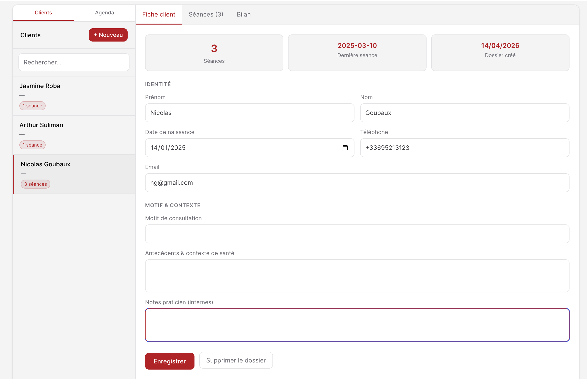
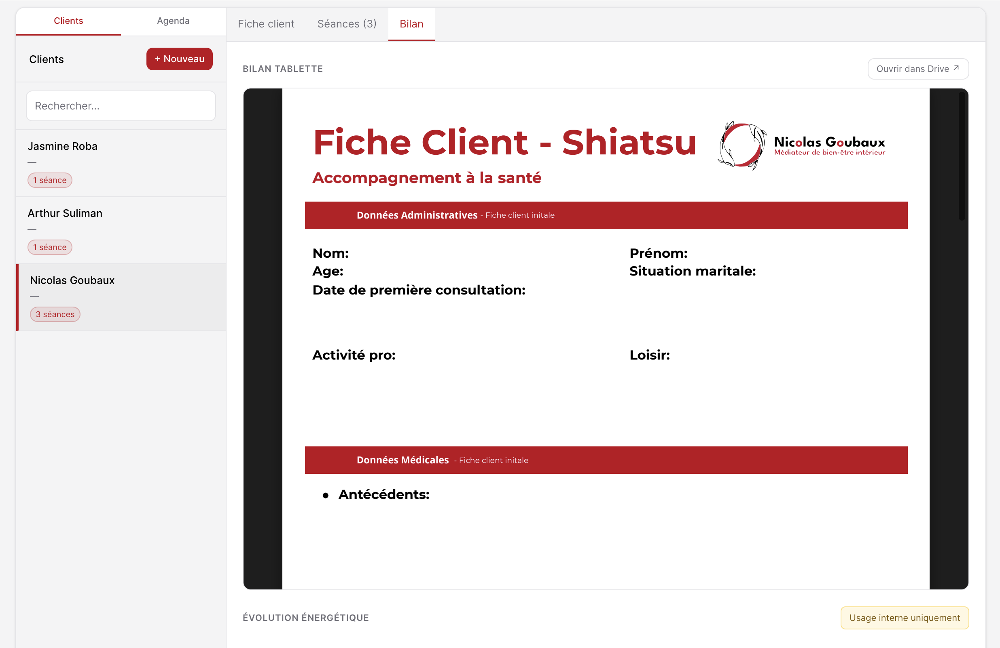
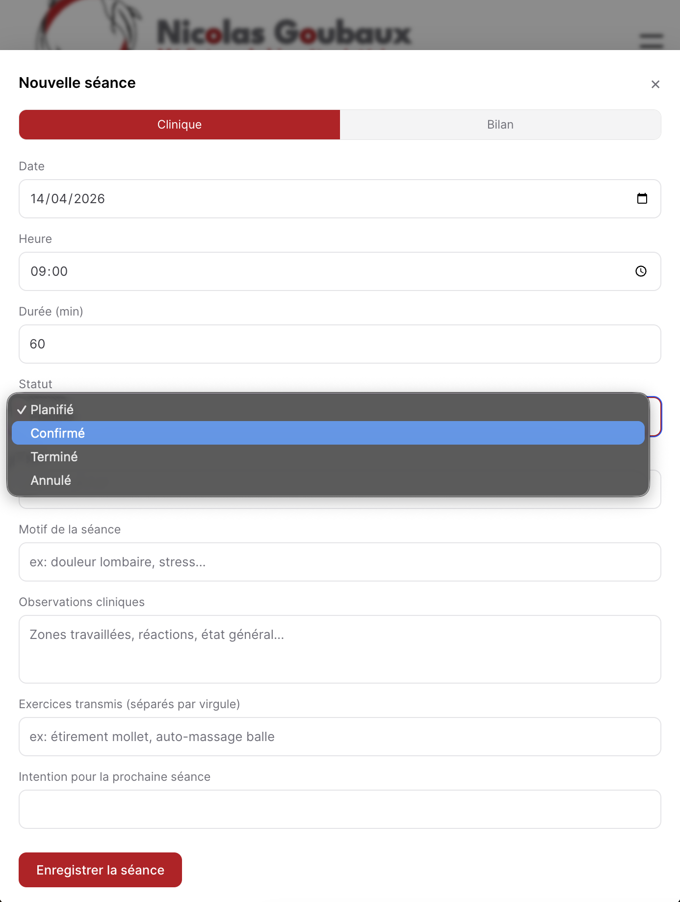
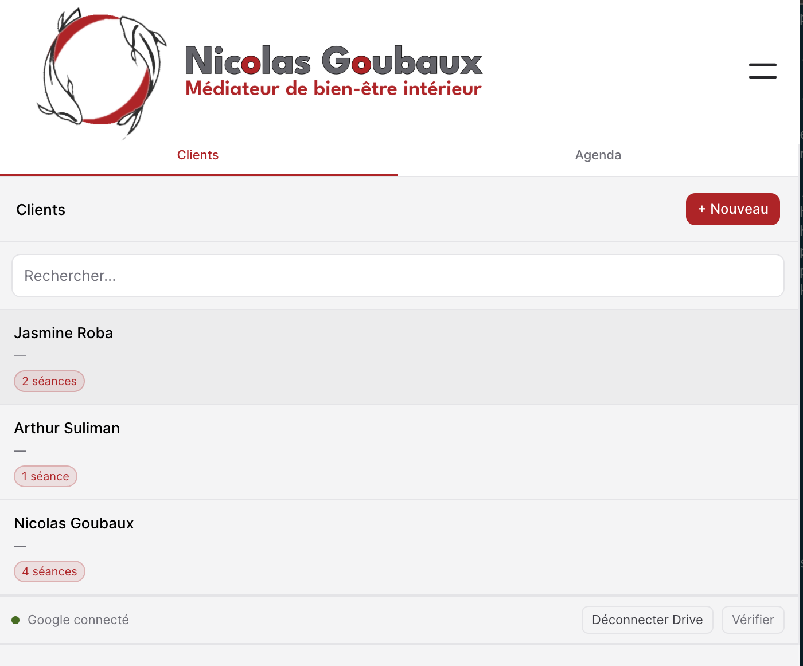
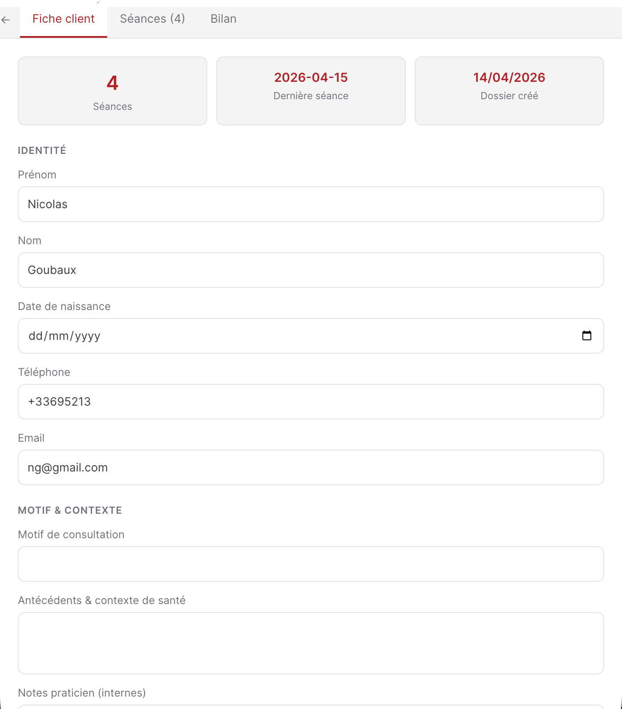

# Cabinet — Plugin Grav

Plugin de gestion de cabinet pour praticiens (shiatsu, sophrologie, etc.), construit sur [Grav CMS](https://getgrav.org). Il centralise les dossiers clients, les rendez-vous, les bilans PDF et les rappels SMS dans une interface mobile-first accessible depuis n'importe quel appareil.



---

## Sommaire

1. [Fonctionnalités](#fonctionnalités)
2. [Prérequis](#prérequis)
3. [Installation](#installation)
4. [Configuration](#configuration)
5. [Mise en place d'une page Cabinet](#mise-en-place-dune-page-cabinet)
6. [Fonctionnement de l'interface](#fonctionnement-de-linterface)
7. [Intégration Google (OAuth, Drive, Agenda)](#intégration-google)
8. [SMS — SMSMobileAPI](#sms--smsmobileapi)
9. [Synchronisation Resalib (Google Apps Script)](#synchronisation-resalib)
10. [API REST](#api-rest)
11. [Scheduler Grav — Rappels automatiques](#scheduler-grav)
12. [Structure des fichiers](#structure-des-fichiers)
13. [Logs et débogage](#logs-et-débogage)

---

## Fonctionnalités

| Module | Description |
|--------|-------------|
| **Clients** | Dossiers clients stockés via Flex Objects (prénom, nom, DDN, téléphone, email, motif, antécédents, notes) |
| **Rendez-vous** | CRUD complet des séances (date, heure, durée, type, statut, observations, exercices) |
| **Agenda** | Vue calendrier par jour, triée par heure, avec synchronisation Google Calendar |
| **Bilan PDF** | Visualisation et upload des bilans Boox (NoteAir) depuis Google Drive |
| **Facturation** | Récapitulatif des séances réalisées par client |
| **SMS** | Envoi manuel du SMS de préparation de visite + rappels automatiques J-1 via SMSMobileAPI |
| **Resalib Sync** | Script Google Apps Script pour synchroniser les RDV Resalib → Cabinet |
| **API REST** | Endpoints JSON sécurisés (session Grav ou clé API) pour intégration avec Make.com ou scripts tiers |

---

## Prérequis

- **Grav** ≥ 1.7.0
- Plugin **Login** (authentification Grav)
- Plugin **Flex Objects** (stockage des données)
- PHP ≥ 7.4
- Accès HTTPS recommandé (requis pour Google OAuth et Service Worker PWA)

---

## Installation

1. Copier le dossier `cabinet` dans `user/plugins/cabinet/`.

2. Vider le cache Grav :

   ```bash
   php bin/grav cache --purge
   # ou
   rm -rf cache/*
   ```

3. Activer le plugin dans l'administration Grav :  
   **Plugins → Cabinet → Activer**

   Ou directement dans `user/plugins/cabinet/cabinet.yaml` :

   ```yaml
   enabled: true
   ```

---

## Configuration

Tous les paramètres sont configurables depuis l'administration Grav (**Plugins → Cabinet**) ou directement dans `user/plugins/cabinet/cabinet.yaml`.

```yaml
enabled: true

# Clé secrète pour l'accès API externe (Make, scripts, etc.)
# Générer une clé longue et aléatoire avant déploiement
api_key: 'CHANGE_ME_BEFORE_DEPLOY'

# Origine CORS (* = toutes origines, ou URL précise)
allowed_origin: '*'

# Google OAuth 2.0
google_oauth_client_id: ''      # ex: xxxx.apps.googleusercontent.com
google_calendar_id: ''          # ex: xxxx@group.calendar.google.com
drive_bilan_path: 'onyx/NoteAir5c/Cahiers/clients'  # Chemin Drive des bilans

# SMS — SMSMobileAPI
sms_enabled: false              # Active les rappels automatiques J-1
sms_api_key: ''                 # Clé API SMSMobileAPI
sms_rappel_cron: '0 8 * * *'   # Expression cron (ici : tous les jours à 8h00)
```

### Paramètres détaillés

| Paramètre | Description |
|-----------|-------------|
| `api_key` | Clé secrète envoyée dans l'en-tête HTTP `X-Api-Key` par les scripts externes. Changer impérativement avant mise en production. |
| `allowed_origin` | En-tête CORS `Access-Control-Allow-Origin`. Utiliser `*` ou l'URL exacte du site. |
| `google_oauth_client_id` | Client ID OAuth 2.0 créé dans Google Cloud Console (voir [section Google](#intégration-google)). |
| `google_calendar_id` | Identifiant du calendrier Google à synchroniser avec l'agenda Cabinet. |
| `drive_bilan_path` | Chemin du dossier sur Google Drive contenant les sous-dossiers clients avec leurs bilans PDF. Séparateur `/`, sans slash en début ou fin. Exemple : `onyx/NoteAir5c/Cahiers/clients`. |
| `sms_enabled` | Active l'envoi automatique des rappels SMS la veille des rendez-vous via le scheduler Grav. |
| `sms_api_key` | Clé API SMSMobileAPI (voir [section SMS](#sms--smsmobileapi)). |
| `sms_rappel_cron` | Expression cron définissant l'heure d'envoi des rappels. |

---

## Mise en place d'une page Cabinet

1. Dans l'administration Grav, créer une nouvelle page.
2. Choisir le template **Cabinet** dans la liste des types de page.
3. Dans les options avancées, activer l'accès réservé aux membres connectés :  
   **Accès → site → login → Oui**
4. Définir le slug de la page : `/cabinet` (le plugin intercepte ce chemin).

L'interface applicative est une SPA (Single Page Application) chargée dans cette page.

---

## Fonctionnement de l'interface

### Onglet Clients (sidebar gauche)

- **Liste des clients** triée alphabétiquement avec compteur de séances.
- **Nouveau client** : bouton `+` en haut de liste.
- **Recherche** : champ de filtre en temps réel.

### Fiche client (onglet Fiche)

- Formulaire d'identité : prénom, nom, date de naissance, téléphone, email.
- Motif de consultation, antécédents, notes internes.
- Section **Lien Grav** : lie le client à un contact Grav existant (recherche par email ou nom).
- **SMS préparation visite** : textarea pré-rempli avec un message personnalisé, boutons *Envoyer SMS* et *Copier*.

### Séances (onglet Séances)



- Liste de toutes les séances du client, dans l'ordre chronologique inverse.
- Bouton **Nouvelle séance** pour créer un rendez-vous.

  

- Chaque séance est éditable : date, heure, durée, type, statut, motif, observations, exercices, prochaine séance, bilan énergétique.
- Option **Désactiver le rappel SMS J-1** par séance.
- Synchronisation Google Calendar : crée/met à jour l'événement dans l'agenda configuré.

### Bilan (onglet Bilan)

- Affiche le PDF du bilan Boox (tablette NoteAir) stocké sur Google Drive.
- Chemin attendu sur Drive : `onyx/NoteAir5c/Cahiers/clients/<prénom> <nom>/<fichier>.pdf`
- Si aucun bilan n'est trouvé, bouton **Envoyer la fiche vierge sur Drive** (upload du template PDF depuis `assets/Fiche Client - Shiatsu.pdf`).
- Visionneuse PDF intégrée (iframe, sans téléchargement).

### Agenda (sidebar droite / vue agenda)


- Rendez-vous regroupés par jour, triés par heure.
- Synchronisation avec Google Calendar pour voir les événements en temps réel.

### Vue mobile

Sur écran étroit, l'interface passe en vue pleine largeur : la sidebar s'affiche en premier, puis la fiche client s'ouvre au tap avec un bouton retour.

| Liste des clients | Fiche client |
|---|---|
|  |  |

### Vérification globale

- Bouton **Vérifier** (icône loupe) dans la barre de navigation.
- Lance un audit de tous les clients : présence du bilan Drive + cohérence de l'agenda Google Calendar.
- Affiche un log en direct avec indicateurs ✓ / ⚠.

---

## Intégration Google

### Créer un Client OAuth 2.0

1. Aller sur [Google Cloud Console](https://console.cloud.google.com/).
2. Créer un projet (ou sélectionner un projet existant).
3. Activer les APIs :
   - **Google Drive API**
   - **Google Calendar API**
4. Aller dans **APIs & Services → Identifiants → Créer des identifiants → ID client OAuth 2.0**.
5. Type d'application : **Application Web**.
6. Ajouter l'URL du site dans **Origines JavaScript autorisées** (ex: `https://monsite.com`).
7. Copier le **Client ID** et le coller dans la configuration du plugin (`google_oauth_client_id`).

### Flux d'authentification

L'authentification utilise **Google Identity Services (GIS)** en flux implicite côté client. Le token d'accès est stocké en `sessionStorage` avec vérification d'expiration. En cas d'expiration, une ré-authentification silencieuse est tentée automatiquement.

Scopes demandés :
- `https://www.googleapis.com/auth/drive.file` — lecture/écriture des fichiers créés par l'app
- `https://www.googleapis.com/auth/drive.readonly` — lecture des bilans Boox
- `https://www.googleapis.com/auth/documents` — (réservé)
- `https://www.googleapis.com/auth/calendar.events` — lecture/écriture des événements Calendar

### Structure des bilans sur Google Drive

Le chemin est configurable dans l'administration du plugin (`drive_bilan_path`). Par défaut :

```
Mon Drive/
└── onyx/                          ← driveBilanPath = "onyx/NoteAir5c/Cahiers/clients"
    └── NoteAir5c/
        └── Cahiers/
            └── clients/           ← dossier racine des bilans
                ├── Anne DUPONT/   ← sous-dossier = "Prénom NOM"
                │   └── bilan-2024-03.pdf
                └── Jean MARTIN/
                    └── bilan-energetique.pdf
```

Le nom du sous-dossier doit correspondre au **prénom + nom** du client (insensible à la casse).

Pour une structure différente (ex: NAS monté, autre tablette), modifier `drive_bilan_path` dans la configuration :

```yaml
drive_bilan_path: 'Documents/Shiatsu/bilans'
```

### Google Calendar

Renseigner l'identifiant du calendrier dans la configuration (`google_calendar_id`). Il est visible dans les paramètres du calendrier Google → **Adresse de l'agenda**.

Format : `xxxxxxxx@group.calendar.google.com`

---

## SMS — SMSMobileAPI

### Compte SMSMobileAPI

1. Créer un compte sur [app.smsmobileapi.com](https://app.smsmobileapi.com).
2. Installer l'application SMSMobileAPI sur un smartphone Android connecté en permanence.
3. Récupérer la clé API dans **Mon compte** et la coller dans la configuration (`sms_api_key`).

### Envoi manuel (SMS de préparation)

Depuis la fiche client, onglet **Fiche** :
1. Le message de préparation est affiché dans la zone SMS.
2. Cliquer sur **Envoyer SMS** pour l'envoyer directement au numéro du client.
3. Ou **Copier** pour le coller ailleurs.

Le numéro de téléphone est normalisé automatiquement : `06XXXXXXXX` → `+336XXXXXXXX`.

### Rappels automatiques J-1

Lorsque `sms_enabled: true`, le scheduler Grav envoie automatiquement un rappel SMS la veille de chaque rendez-vous non annulé.

Message envoyé :
```
Bonjour [Prénom],

Rappel : vous avez une séance de shiatsu demain à [heure].

📍 [adresse] 🔐 Code : XXXX 🏢 [détails]

À demain, Nicolas
```

> Pour personnaliser ce message, modifier la méthode `buildRappelMessage()` dans `classes/Sms.php`.

### Désactiver le rappel pour une séance

Dans le formulaire d'édition d'une séance, cocher **Désactiver le rappel SMS J-1**. Ce paramètre est également visible et modifiable depuis l'administration Grav (Flex Objects → Rendez-vous).

### Logique anti-doublon

Le plugin enregistre la date d'envoi dans `sms_rappel_sent_date`. Un rappel ne peut être envoyé qu'une seule fois par jour et par rendez-vous.

---

## Synchronisation Resalib

Le fichier `assets/resalib-sync.gs` est un **Google Apps Script** qui synchronise automatiquement les événements du calendrier Resalib vers le plugin Cabinet via l'API REST.

### Installation

1. Aller sur [script.google.com](https://script.google.com) → **Nouveau projet**.
2. Coller le contenu de `assets/resalib-sync.gs`.
3. Dans le menu **Services**, ajouter **Google Calendar API**.
4. Configurer la section `CONFIG` :

```javascript
const CONFIG = {
  CALENDAR_ID:  'xxxx@group.calendar.google.com', // Calendrier Resalib
  WEBHOOK_URL:  'https://script.google.com/macros/s/XXXX/exec', // URL du script déployé
  CABINET_BASE_URL: 'https://monsite.com',
  CABINET_API_KEY:  'votre-cle-api',
  // ...
};
```

5. **Déployer** → Nouveau déploiement → Type : **Application web** → Accès : **Tout le monde**.
6. Copier l'URL de déploiement dans `CONFIG.WEBHOOK_URL`.
7. Exécuter **`setupAll()`** une seule fois depuis la console du script.

### Fonctionnement

- Google Calendar envoie une notification push (`POST`) au script à chaque modification.
- Le script effectue une sync incrémentale et met à jour les rendez-vous Cabinet via l'API REST.
- Un déclencheur de secours toutes les 15 minutes assure la résilience.
- Le watch channel Google expire après 7 jours et est renouvelé automatiquement.

### Fonctions utiles (console Apps Script)

| Fonction | Description |
|----------|-------------|
| `setupAll()` | Installation initiale (déclencheurs + watch + sync complète) |
| `refreshCalendar()` | Sync complète forcée |
| `inspectEventMap()` | Affiche la correspondance eventId → flex_id |
| `inspectClientMap()` | Affiche la correspondance nom → UUID Cabinet |
| `addClientMapping('Prénom NOM', 'uuid')` | Mapping manuel d'un client |
| `forceSyncEvent('eventId')` | Force la sync d'un événement précis |
| `resetAll()` | Remet tout à zéro |

### Résolution des clients

Le script essaie de trouver le client Cabinet correspondant à un événement Resalib dans cet ordre :

1. Par **email** (attendees Google Calendar)
2. Par **nom extrait du titre** de l'événement Resalib (format : `"Prénom NOM | Resalib.fr"`)
3. Via l'**API Cabinet** `/api/contacts/search`
4. Si introuvable : utiliser `addClientMapping()` pour ajouter un mapping manuel

---

## API REST

Toutes les routes retournent du JSON. L'authentification se fait soit par **session Grav** (utilisateur connecté), soit par **clé API** dans l'en-tête HTTP `X-Api-Key`.

### Routes publiques (session Grav uniquement)

| Méthode | Route | Description |
|---------|-------|-------------|
| `GET` | `/api/cabinet/data` | Données complètes (clients, séances, config) |
| `GET` | `/api/cabinet/facturation` | Récapitulatif de facturation |
| `POST` | `/api/cabinet/sms/preparation` | Envoyer le SMS de préparation |
| `GET` | `/cabinet/bilan-template.pdf` | Télécharger le template PDF |

### Routes session ou clé API

| Méthode | Route | Description |
|---------|-------|-------------|
| `POST` | `/api/cabinet/clients` | Créer un client |
| `PUT` | `/api/cabinet/clients/{id}` | Modifier un client |
| `DELETE` | `/api/cabinet/clients/{id}` | Supprimer un client |
| `GET` | `/api/cabinet/rendezvous` | Lister tous les rendez-vous |
| `POST` | `/api/cabinet/rendezvous` | Créer un rendez-vous |
| `PUT` | `/api/cabinet/rendezvous/{flex_id}` | Modifier un rendez-vous |
| `DELETE` | `/api/cabinet/rendezvous/{flex_id}` | Supprimer un rendez-vous |
| `GET` | `/api/contacts/search?first_name=&last_name=` | Rechercher un client par nom |
| `POST` | `/api/cabinet/sms/rappels` | Déclencher manuellement les rappels J-1 |

### Exemple d'appel API (curl)

```bash
# Créer un rendez-vous depuis un script externe
curl -X POST https://monsite.com/api/cabinet/rendezvous \
  -H "X-Api-Key: votre-cle-api" \
  -H "Content-Type: application/json" \
  -d '{
    "client_id": "uuid-du-client",
    "datetime": "2025-06-15T10:00",
    "duree": 90,
    "status": "scheduled",
    "appointment_type": "shiatsu_futon",
    "motif": "Douleurs dorsales"
  }'
```

---

## Scheduler Grav

Le plugin utilise le **scheduler intégré de Grav** pour les rappels SMS automatiques.

### Activer le scheduler

Ajouter la tâche cron suivante sur le serveur :

```bash
* * * * * cd /chemin/vers/grav && php bin/grav scheduler 1>> /dev/null 2>&1
```

Vérifier que le scheduler fonctionne dans l'administration : **Outils → Scheduler**.

### Job enregistré

| ID | Description | Déclencheur |
|----|-------------|-------------|
| `cabinet-sms-rappels` | Rappels SMS J-1 | Configurable via `sms_rappel_cron` |

Le job n'est enregistré que si `sms_enabled: true` dans la configuration du plugin.

Les logs d'exécution sont disponibles dans `logs/cabinet-sms-rappels.out`.

---

## Structure des fichiers

```
user/plugins/cabinet/
├── cabinet.php                          # Classe principale du plugin
├── cabinet.yaml                         # Configuration par défaut
├── blueprints.yaml                      # Définition du formulaire d'administration
│
├── assets/
│   ├── cabinet.js                       # Application SPA (frontend)
│   ├── cabinet.css                      # Styles
│   ├── manifest.json                    # PWA manifest
│   ├── sw.js                            # Service Worker (PWA)
│   ├── Fiche Client - Shiatsu.pdf       # Template PDF bilan vierge
│   └── resalib-sync.gs                  # Google Apps Script (Resalib → Cabinet)
│
├── blueprints/
│   ├── cabinet.yaml                     # Blueprint de la page Cabinet
│   └── flex-objects/
│       ├── clients.yaml                 # Schéma Flex Objects — clients
│       └── rendez_vous.yaml             # Schéma Flex Objects — rendez-vous
│
├── classes/
│   ├── Core.php                         # Auth, CORS, helpers JSON
│   ├── Api.php                          # Routeur des endpoints REST
│   ├── Clients.php                      # Recherche de contacts
│   ├── Seances.php                      # CRUD clients & rendez-vous, payloads
│   ├── Facturation.php                  # Calcul du récapitulatif de facturation
│   ├── Sms.php                          # Envoi SMS (SMSMobileAPI)
│   └── Flex/
│       └── RendezVousObject.php         # Classe Flex personnalisée pour les RDV
│
└── templates/
    ├── cabinet.html.twig                # Template de la page principale
    └── partials/ ...                    # Partials Twig
```

### Stockage des données

Les données sont stockées au format JSON via Flex Objects :

| Collection | Chemin |
|-----------|--------|
| Clients | `user/data/flex-objects/clients/` |
| Rendez-vous | `user/data/rendez_vous/` |

---

## Logs et débogage

Le plugin écrit ses logs dans `logs/cabinet.log` (à la racine de Grav) et dans le log système Grav.

Format :
```
[2025-06-15 08:00:01] [cabinet] SMS send {"to":"+336XXXXXXXX","len":142}
[2025-06-15 08:00:02] [cabinet] SMS response {"raw":"{\"status\":\"success\"}"}
```

Pour désactiver les logs, modifier la méthode `isDebugEnabled()` dans `classes/Core.php` :

```php
public function isDebugEnabled(): bool
{
    return false; // désactiver en production si les logs deviennent volumineux
}
```

---

## Licence

MIT — Nicolas Goubaux — [goubs.net](https://www.goubs.net)
